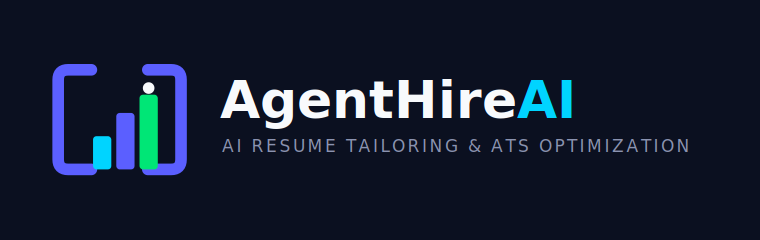

<div align="center">



# AgentHire AI

**AI-powered resume tailoring & ATS optimisation — powered by IBM Watsonx.ai & Granite LLMs**

[](https://streamlit.io)
[](https://www.ibm.com/watsonx)
[](https://python.org)
[](https://docs.pydantic.dev)
[](LICENSE)

</div>

---
[Streamlit](https://agenthireai-ibm-granite-7spu8w5qryiwarvohk9mud.streamlit.app/)  
[GitHub](https://github.com/gourav-0613/AgentHireAI-IBM-Granite)  

## Overview

AgentHire AI is a production-ready Streamlit application that helps job-seekers beat Applicant Tracking Systems (ATS) and land more interviews. Upload your PDF resume, paste a job description, and a pipeline of **five specialised IBM Granite agents** will:

1. **Parse** your resume into structured data
2. **Decompose** the job description into skills, responsibilities, and requirements
3. **Identify** skill gaps and transferable strengths
4. **Optimise** ATS keyword coverage with relevance-weighted scores
5. **Rewrite** your resume summary and experience bullets — then generate a polished, ATS-friendly PDF

All scoring is **deterministic** (no LLM hallucination risk on the score). Everything runs in-memory — no data is stored or shared.

---

## Features

| Feature | Description |
|---|---|
| 📄 **PDF Resume Parser** | Agent 1 extracts personal info, experience, education, skills, projects, and certifications from any standard PDF |
| 📋 **JD Analyzer** | Agent 2 decomposes job postings into required/preferred skills, seniority signals, and responsibilities |
| 🧠 **Skill Gap Analyzer** | Agent 3 compares your profile against the JD — matched skills, critical gaps, transferable skills, and actionable recommendations |
| 🔑 **ATS Keyword Optimizer** | Agent 4 identifies and ranks ATS keywords with relevance weights, surfacing missing high-priority terms |
| ✨ **Resume Tailor** | Agent 5 rewrites your summary and bullet points with JD-aligned language and generates a download-ready PDF |
| 📊 **Deterministic Scorer** | Python-based ATS match score (0–100) with a per-signal breakdown — no LLM involved in scoring |
| 📥 **PDF Download** | One-click download of the tailored, ATS-compliant PDF resume |

---

## Architecture

```
┌─────────────────────────────────────────────────────────┐
│                    Streamlit UI Layer                    │
│   app.py · pages/1_Home.py · pages/2_Analyzer.py        │
│   components/ (theme, score_gauge, skill_gap_chart, …)  │
└────────────────────────┬────────────────────────────────┘
                         │ calls
┌────────────────────────▼────────────────────────────────┐
│                   Core Pipeline Layer                    │
│   core/pipeline.py  ←→  core/session_state.py           │
│   core/scorer.py        core/pdf_generator.py           │
│   core/pdf_reader.py    core/watsonx_client.py          │
└────────────────────────┬────────────────────────────────┘
                         │ delegates LLM calls
┌────────────────────────▼────────────────────────────────┐
│                  Five Agent Modules                      │
│   agents/resume_parser.py   (Agent 1 — IBM Granite)     │
│   agents/jd_analyzer.py     (Agent 2 — IBM Granite)     │
│   agents/skill_gap_analyzer.py (Agent 3)                │
│   agents/ats_optimizer.py   (Agent 4)                   │
│   agents/resume_tailor.py   (Agent 5)                   │
└────────────────────────┬────────────────────────────────┘
                         │ validated by
┌────────────────────────▼────────────────────────────────┐
│                  Pydantic v2 Data Models                 │
│   models/resume.py · models/job_description.py          │
│   models/analysis.py                                    │
└────────────────────────┬────────────────────────────────┘
                         │ LLM inference via
┌────────────────────────▼────────────────────────────────┐
│              IBM Watsonx.ai (IBM Cloud)                  │
│   ibm/granite-4-h-small        (extraction agents)      │
│   ibm/granite-4-h-small        (generation agents)      │
└─────────────────────────────────────────────────────────┘
```

**Key design decisions:**
- **Session state as shared memory** — all pipeline outputs are written to and read from Streamlit's session state via typed accessors in `core/session_state.py`
- **Lazy IBM SDK initialisation** — the `WatsonxClient` singleton creates the SDK object only on the first `generate()` call, so the module is importable in test environments without credentials
- **Retry with exponential back-off** — transient Watsonx API errors are retried up to `WATSONX_MAX_RETRIES` times with configurable back-off
- **Deterministic scoring** — the final ATS match score is computed with pure Python logic in `core/scorer.py` — no LLM call, fully reproducible

---

## Folder Structure

```
AgentHireAI/
├── app.py                        # Streamlit entry point & sidebar shell
├── requirements.txt              # Python dependencies
├── styles.css                    # Global dark-UI design system
├── .env.example                  # Environment variable template
├── .gitignore                    # Git ignore rules
│
├── .streamlit/
│   └── config.toml               # Streamlit theme & client settings
│
├── assets/
│   ├── favicon.svg               # Browser tab icon
│   ├── icon.svg                  # Brand mark (folded-resume + ATS check)
│   ├── logo.svg                  # Full wordmark lockup
│   └── palette-reference.svg     # Design system colour reference
│
├── agents/                       # Five LLM-backed agents
│   ├── __init__.py
│   ├── resume_parser.py          # Agent 1 — PDF text → ResumeProfile
│   ├── jd_analyzer.py            # Agent 2 — JD text → JobDescription
│   ├── skill_gap_analyzer.py     # Agent 3 — gap analysis → SkillGapAnalysis
│   ├── ats_optimizer.py          # Agent 4 — keyword analysis → ATSScore
│   └── resume_tailor.py          # Agent 5 — tailoring → TailoredResume + PDF
│
├── components/                   # Streamlit UI components (presentation only)
│   ├── __init__.py
│   ├── keyword_badges.py         # ATS keyword badge grid
│   ├── resume_preview.py         # Parsed & tailored resume renderer
│   ├── score_gauge.py            # Plotly gauge + score breakdown table
│   ├── skill_gap_chart.py        # Skill gap horizontal bar chart
│   └── theme.py                  # CSS loader, icons, brand helpers
│
├── config/
│   ├── __init__.py
│   ├── prompts.py                # Agent prompt templates (system + user)
│   └── settings.py               # Centralised env-var config (singleton)
│
├── core/                         # Business logic — no UI code
│   ├── __init__.py
│   ├── pdf_generator.py          # ReportLab ATS-friendly PDF builder
│   ├── pdf_reader.py             # PyMuPDF text extraction
│   ├── pipeline.py               # Stage orchestrator (IDLE→PARSED→ANALYZED→COMPLETE)
│   ├── scorer.py                 # Deterministic ATS scoring engine
│   ├── session_state.py          # Typed session-state accessors & stage constants
│   └── watsonx_client.py         # IBM Watsonx.ai singleton client + retry logic
│
├── models/                       # Pydantic v2 data models (agent I/O contracts)
│   ├── __init__.py
│   ├── analysis.py               # SkillGapAnalysis, ATSScore, TailoredResume, ResumeAnalysis
│   ├── job_description.py        # JobDescription, RequiredSkill, PreferredSkill
│   └── resume.py                 # ResumeProfile, PersonalInfo, WorkExperience, …
│
├── pages/
│   ├── 1_Home.py                 # Landing page — hero, workflow, feature cards
│   └── 2_Analyzer.py             # Full 5-step pipeline UI
│
├── tests/
│   ├── __init__.py
│   ├── fixtures/                 # Test PDF and JD fixtures
│   ├── test_ats_optimizer.py
│   ├── test_jd_analyzer.py
│   ├── test_resume_parser.py
│   ├── test_scorer.py
│   └── test_skill_gap.py
│
└── utils/
    ├── __init__.py
    ├── text_cleaner.py           # Text normalisation helpers
    └── validators.py             # PDF upload & JD text guards
```

---

## Installation

### Prerequisites

- Python **3.10** or higher
- An **IBM Cloud** account with Watsonx.ai access
- An **IBM Watson Studio** project

### 1. Clone the repository

```bash
git clone https://github.com/your-org/agenthire-ai.git
cd agenthire-ai/AgentHireAI
```

### 2. Create a virtual environment

```bash
python -m venv .venv

# macOS / Linux
source .venv/bin/activate

# Windows (PowerShell)
.venv\Scripts\Activate.ps1
```

### 3. Install dependencies

```bash
pip install -r requirements.txt
```

### 4. Configure environment variables

```bash
cp .env.example .env
# Edit .env and fill in your IBM Watsonx credentials
```

---

## IBM Watsonx Setup

### Step 1 — Create an IBM Cloud account

Sign up at [cloud.ibm.com](https://cloud.ibm.com) if you do not already have an account.

### Step 2 — Provision Watsonx.ai

1. In the IBM Cloud catalogue, search for **Watson Machine Learning** and provision an instance (the Lite tier is sufficient for development).
2. Navigate to **IBM Watsonx.ai** ([watsonx.ai](https://dataplatform.cloud.ibm.com/wx/home)) and create a **project**.

### Step 3 — Obtain your credentials

| Credential | Where to find it |
|---|---|
| `IBM_WATSONX_API_KEY` | IBM Cloud → Manage → Access (IAM) → API keys → Create |
| `IBM_WATSONX_PROJECT_ID` | Watsonx.ai → Your project → Manage tab → General → Project ID |
| `IBM_WATSONX_URL` | Defaults to `https://us-south.ml.cloud.ibm.com` (Dallas). Change for other regions — see [Endpoint URLs](https://cloud.ibm.com/apidocs/watsonx-ai#endpoint-url) |

### Step 4 — Verify model access

Ensure the following IBM Granite foundation models are available in your project:

- `ibm/granite-4-h-small` — used for structured extraction (Agents 1 & 2)
- `ibm/granite-4-h-small` — used for generation & tailoring (Agents 3–5)

If needed, update `WATSONX_MODEL_EXTRACTION` and `WATSONX_MODEL_GENERATION` in your `.env` to use alternative Granite model IDs available in your region.

---

## Environment Variables

Copy `.env.example` to `.env` and fill in the required values. All variables are read at startup by `config/settings.py`.

| Variable | Required | Default | Description |
|---|---|---|---|
| `IBM_WATSONX_API_KEY` | ✅ | — | IBM Cloud API key |
| `IBM_WATSONX_PROJECT_ID` | ✅ | — | Watson Studio project ID |
| `IBM_WATSONX_URL` | ✅ | `https://us-south.ml.cloud.ibm.com` | Watsonx.ai regional endpoint |
| `WATSONX_MODEL_EXTRACTION` | ☑️ | `ibm/granite-4-h-small` | Granite model for Agents 1 & 2 |
| `WATSONX_MODEL_GENERATION` | ☑️ | `ibm/granite-4-h-small` | Granite model for Agents 3–5 |
| `WATSONX_MAX_TOKENS_EXTRACTION` | ☑️ | `1500` | Token cap for extraction calls |
| `WATSONX_MAX_TOKENS_GENERATION` | ☑️ | `3000` | Token cap for generation calls |
| `WATSONX_TEMPERATURE_EXTRACTION` | ☑️ | `0.1` | Temperature for extraction (low = deterministic) |
| `WATSONX_TEMPERATURE_GENERATION` | ☑️ | `0.7` | Temperature for generation (higher = creative) |
| `PDF_MAX_SIZE_MB` | ☑️ | `5` | Maximum PDF upload size in MB |
| `WATSONX_MAX_RETRIES` | ☑️ | `3` | Number of retry attempts on transient API errors |
| `WATSONX_RETRY_BACKOFF_BASE` | ☑️ | `2.0` | Exponential back-off base (seconds) |

> **✅ Required** — the app will not start the analysis pipeline without these three.
> **☑️ Optional** — sensible defaults are provided; override only if needed.

---

## Running Locally

```bash
# From the AgentHireAI/ directory
streamlit run app.py
```

The app will open at `http://localhost:8501`.

### Verify your setup

1. The sidebar should show **"Awaiting resume upload"** (IDLE state).
2. Navigate to **Resume Analyzer** and upload a PDF resume.
3. If IBM credentials are missing, you will see a clear error message when the pipeline runs — no crash on startup.

### Running Tests

```bash
# From the AgentHireAI/ directory
pytest tests/ -v
```

The test suite uses mocks for all IBM API calls and does not require live credentials.

---

## Streamlit Community Cloud Deployment

### Step 1 — Push to GitHub

Ensure your repository is on GitHub. The root of the Streamlit app must be `AgentHireAI/app.py`.

### Step 2 — Create a new app on Streamlit Cloud

1. Go to [share.streamlit.io](https://share.streamlit.io) and sign in with GitHub.
2. Click **New app** → select your repository.
3. Set the **Main file path** to `AgentHireAI/app.py`.

### Step 3 — Configure secrets

In the Streamlit Cloud dashboard, open **Settings → Secrets** and add:

```toml
IBM_WATSONX_API_KEY = "your-api-key-here"
IBM_WATSONX_PROJECT_ID = "your-project-id-here"
IBM_WATSONX_URL = "https://us-south.ml.cloud.ibm.com"
```

> **Important:** Streamlit Cloud secrets are injected as environment variables. The app reads them via `python-dotenv` / `os.getenv` and will work without a `.env` file when deployed.

### Step 4 — Deploy

Click **Deploy**. Streamlit will install `requirements.txt` automatically. First cold start may take 2–3 minutes.

### Streamlit Cloud Compatibility Notes

- All dependencies in `requirements.txt` are compatible with Streamlit Community Cloud's Linux/Python 3.10+ environment.
- `PyMuPDF` (fitz) is a binary wheel — it is available on the Streamlit Cloud build image.
- `reportlab` and `plotly` are pure-Python or have wheels — no system dependencies required.
- `ibm-watson-machine-learning` requires an active internet connection to reach the IBM Cloud endpoint.

---

## Screenshots

> _Screenshots will be added after the first production deployment._

| Home / Landing Page | Resume Analyzer — Upload | Results — Skill Gap |
|---|---|---|
| `[screenshot_home.png]` | `[screenshot_upload.png]` | `[screenshot_skill_gap.png]` |

| Results — ATS Keywords | Results — Match Score | Results — Tailored Resume |
|---|---|---|
| `[screenshot_ats.png]` | `[screenshot_score.png]` | `[screenshot_tailored.png]` |

---

## Future Improvements

| Priority | Feature |
|---|---|
| 🔴 High | **Multi-format upload** — support `.docx` and plain-text resumes in addition to PDF |
| 🔴 High | **Streaming output** — stream Granite responses token-by-token for a faster perceived UX |
| 🟡 Medium | **Cover letter generator** — Agent 6 that generates a tailored cover letter from the same inputs |
| 🟡 Medium | **Interview question predictor** — surface likely interview questions based on the JD and skill gaps |
| 🟡 Medium | **History / versioning** — store multiple resume × JD runs per session for comparison |
| 🟢 Low | **Dark/light theme toggle** — expose the existing Streamlit theme toggle to the user |
| 🟢 Low | **Batch mode CLI** — headless `run_full_pipeline()` CLI for processing multiple resumes at once |
| 🟢 Low | **Alternative LLM backends** — abstract `WatsonxClient` behind a protocol to swap in other providers |

---

## License

MIT © AgentHire AI Contributors
